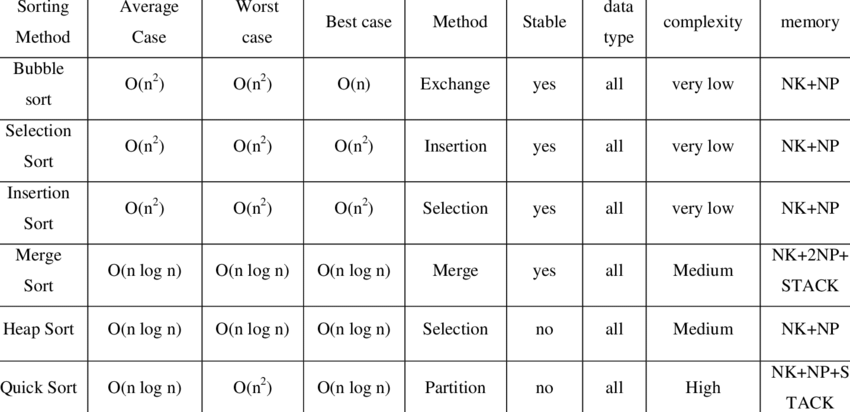

<h3>Examples of important algorithms for use in development written in the Python 3.8 programming language.</h3>

The file <b>time_it.py</b> is used to check the speed of algorithm execution and compare them. 
Which also allows you to run the execution of algorithms in a multiprocessor (as far as Python allows).

<h3>What algorithms are present and their speed.</h3>

